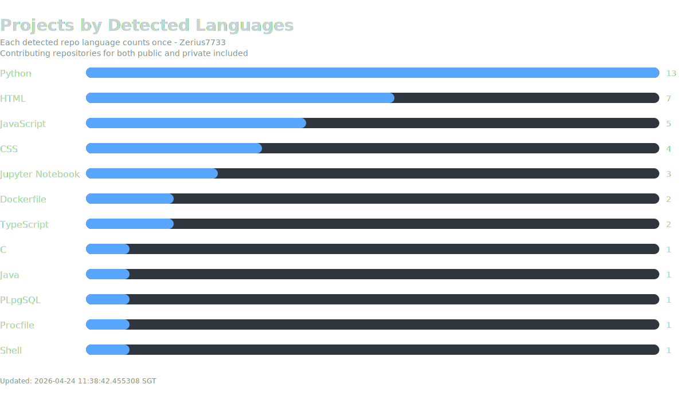
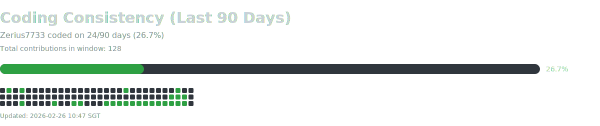
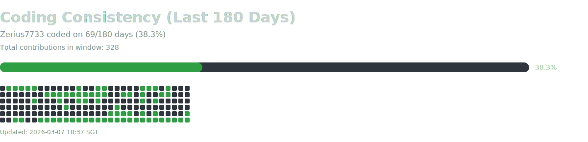
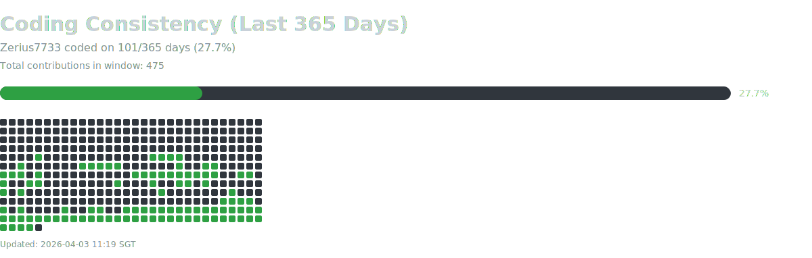

## About Me

I am a Computer Engineering student focused on building practical software with strong backend design and AI integration.

- Interests: AI applications, backend engineering, data analysing
- Current focus: building up more experience of different varieties
- Goal: become a strong full-stack engineer with deep systems understanding

## Hackathons :computer:
**<ins>Ascent - TechFest 2026</ins>**  
AI-powered career development platform with multi-agent LLM reasoning, resume analysis, and personalized roadmap generation.
- Stack: Python, FastAPI, LLM workflows, OCR, vector search
- Repo: [TechFest-2026](https://github.com/Zerius7733/TechFest-2026)

**<ins>WhatsApp Business Chatbot</ins>**  
Modular WhatsApp chatbot using FastAPI, RAG, Postgres persistence, and deduplication for reliable customer support automation.
- Stack: Python, FastAPI, OpenAI API, ChromaDB, Postgres
- Repo: [whatsapp-business](https://github.com/simplyziannn/whatsapp-business)

**<ins>PSA Hackathon 2025 - CodeSprint</ins>**  
PSA hackathon operations-automation project using LLM workflows to triage incidents and generate SOP/escalation recommendations from enterprise logs and documents.
- Stack: Python, OpenAI API, document processing, React/Vite
- Repo: [psa_team_mediocre](https://github.com/Zerius7733/psa_team_mediocre) **(private)**

**<ins>Bio Hackathon 2025</ins>**  
Plant stress-memory research project investigating how prior stress exposure affects resilience using phenotypic, biochemical, microscopic, and transcriptomic analyses.
- Stack: Python, data analysis, transcriptomics workflow
- Repo: [Bio-Hackathon-2025](https://github.com/Zerius7733/Bio-Hackathon-2025) **(private)**

## Academic Projects :mortar_board:
**<ins>Internship Placement Management System</ins>**  
Java OOP system for managing internship applications across students, companies, and career center staff.
- Stack: Java, OOP architecture, MVC-style separation, SOLID framework
- Repo: [internship-portal](https://github.com/Zerius7733/internship-portal)

**<ins>Algorithm Runtime Analysis</ins>**  
Algorithm analysis work covering hybrid sorting, Dijkstra variants, and knapsack runtime comparisons with experiment outputs and plots.
- Stack: Python, algorithm analysis, plotting
- Repo: [Algorithm-Runtime-Analysis](https://github.com/Zerius7733/Algorithm-Runtime-Analysis)

**<ins>Network Traffic Data Analysis</ins>**  
Computer networks lab project analyzing sFlow packet samples to derive protocol/port insights, top communication pairs, and interactive network maps.
- Stack: Python, pandas, matplotlib, NetworkX, PyVis
- Repo: [Network-Traffic-Data-Analysis](https://github.com/Zerius7733/Network-Traffic-Data-Analysis)

**<ins>Group Division Data Analytics</ins>**  
Data analytics project focused on group-division patterns, exploratory analysis, and insight generation from structured datasets.
- Stack: Python, data analytics
- Repo: [Group-Division-Data-Analytic](https://github.com/Zerius7733/Group-Division-Data-Analytic)

## Side-Quests :dart:
**<ins>NTU GPA Estimator</ins>**  
Simple GPA estimation tool for NTU modules to help plan semester performance and expected cumulative outcome.
- Stack: Python
- Repo: [NTU-GPA-Estimator](https://github.com/Zerius7733/NTU-GPA-Estimator)

**<ins>Assets Visualisation</ins>**  
Project focused on visualizing asset-related data for clearer trend and performance insights.
- Stack: Python, data visualization
- Repo: [Assets_Visualisation](https://github.com/Zerius7733/Assets_Visualisation)

**<ins>Lottery Analysis</ins>**  
Utility project for lottery probability exploration and quick outcome analysis.
- Stack: Python
- Repo: [Lottery_Analysis](https://github.com/Zerius7733/Lottery_Analysis)

**<ins>Ledger</ins>**  
Side project for recording and organizing transaction/ledger entries with a simple workflow.
- Stack: Python
- Repo: [Ledger](https://github.com/Zerius7733/Ledger)

## GitHub Stats :bar_chart:

## Tech Toolbox

## Social Media

- [Instagram](https://instagram.com/Zerius7733)
- [LinkedIn](https://www.linkedin.com/in/guan-yibin/)

---

> Open to collaborations on AI, backend systems, and impactful student projects.

