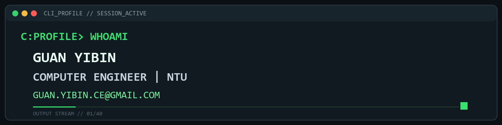

## About Me

I am a Computer Engineering student focused on building practical software with strong backend design and AI integration.

- Interests: AI applications, backend engineering, data analysing
- Current focus: building up more experience of different varieties
- Goal: become a strong full-stack engineer with deep systems understanding

# Hackathons :computer:
**<ins>TicTac TechJam - Volc Agent Launchpad</ins>** 
Hackathon proof of concept for building and running AI agents, with a browser playground, persistent workspaces, multi-agent collaboration, and policy-scoped access to protected resources.
- Stack: TypeScript, React, Vite, Fastify, SQLite, Docker/Podman, Volcengine Ark Responses API, Codex CLI
- Repo: [tictac-techjam](https://github.com/Zerius7733/tictac-techjam)

**<ins>PSA Code Sprint 2.0 2026 - Sprinternship</ins>** 
Interactive port-resilience simulator for human-governed incident response: simulates disruption alerts, uses an AI agent to investigate and classify them, and requires human approval before recovery actions run.
- Stack: React, Vite, Express, OpenAI Responses API, Docker, Server-Sent Events
- Repo: [PSA_SPRINTERNSHIP](https://github.com/simplyziannn/PSA_SPRINTERNSHIP)

**<ins>AWS & CockroachDB Hackathon 2026</ins>**  
Evidence-backed career agent that turns resume experience into durable, inspectable memory, ranks live job openings, and learns from user feedback while keeping account data isolated.
- Stack: React, Node.js, Express, CockroachDB Cloud, vector search, OpenAI Responses and Embeddings APIs, AWS Lambda/ECS, Docker
- Repo: [AWS-CockroachDB-Hackathon](https://github.com/Zerius7733/AWS-CockroachDB-Hackathon)

**<ins>FinTech Innovators' Hackathon 2026 (Finalist, 4th Place)</ins>**  
AI-powered wealth wellness platform that consolidates portfolio data, analyzes financial health, and delivers personalized market and retirement insights.
- Stack: Python, FastAPI, LLM workflows, News Scraping
- Repo: [FinTech-2026](https://github.com/Zerius7733/FinTech)
  
**<ins>TechFest 2026</ins>**  
AI-powered career development platform with multi-agent LLM reasoning, resume analysis, and personalized roadmap generation.
- Stack: Python, FastAPI, LLM workflows, OCR, vector search
- Repo: [TechFest-2026](https://github.com/Zerius7733/TechFest-2026)

**<ins>PSA Hackathon 2025 - CodeSprint</ins>**  
PSA hackathon operations-automation project using LLM workflows to triage incidents and generate SOP/escalation recommendations from enterprise logs and documents.
- Stack: Python, OpenAI API, document processing, React/Vite
- Repo: [psa_team_mediocre](https://github.com/Zerius7733/psa_team_mediocre) **(private)**

**<ins>Bio Hackathon 2025 (1st Place)</ins>**  
Plant stress-memory research project investigating how prior stress exposure affects resilience using phenotypic, biochemical, microscopic, and transcriptomic analyses.
- Stack: Python, data analysis, transcriptomics workflow
- Repo: [Bio-Hackathon-2025](https://github.com/Zerius7733/Bio-Hackathon-2025) **(private)**

# Academic Projects :mortar_board:
**<ins>Internship Placement Management System</ins>**  
Java OOP system for managing internship applications across students, companies, and career center staff.
- Stack: Java, OOP architecture, MVC-style separation, SOLID framework
- Repo: [internship-portal](https://github.com/Zerius7733/internship-portal)

**<ins>Algorithm Runtime Analysis</ins>**  
Algorithm analysis work covering hybrid sorting, Dijkstra variants, and knapsack runtime comparisons with experiment outputs and plots.
- Stack: Python, algorithm analysis, plotting
- Repo: [Algorithm-Runtime-Analysis](https://github.com/Zerius7733/Algorithm-Runtime-Analysis)

**<ins>Network Traffic Data Analysis</ins>**  
Computer networks lab project analyzing sFlow packet samples to derive protocol/port insights, top communication pairs, and interactive network maps.
- Stack: Python, pandas, matplotlib, NetworkX, PyVis
- Repo: [Network-Traffic-Data-Analysis](https://github.com/Zerius7733/Network-Traffic-Data-Analysis)

**<ins>Group Division Data Analytics</ins>**  
Data analytics project focused on group-division patterns, exploratory analysis, and insight generation from structured datasets.
- Stack: Python, data analytics
- Repo: [Group-Division-Data-Analytic](https://github.com/Zerius7733/Group-Division-Data-Analytic)

# Side-Quests :dart:
**<ins>Email Generator Extension</ins>**  
Builds a Chrome extension plus a local backend that captures job-posting details, uses resume-aware retrieval to generate tailored application emails with OpenAI or Ollama, and logs applications to CSV.
- Stack: Chrome Extension (MV3), JavaScript, Node.js, OpenAI/Ollama, pdf-parse, mammoth, CSV-based logging
- Repo: [Email-Generator-Extension](https://github.com/Zerius7733/email-generator-extension)
 
**<ins>WhatsApp Business Chatbot</ins>**  
Modular WhatsApp chatbot using FastAPI, RAG, Postgres persistence, and deduplication for reliable customer support automation.
- Stack: Python, FastAPI, OpenAI API, ChromaDB, Postgres
- Repo: [whatsapp-business](https://github.com/simplyziannn/whatsapp-business)
 
**<ins>NTU GPA Estimator</ins>**  
Simple GPA estimation tool for NTU modules to help plan semester performance and expected cumulative outcome.
- Stack: Python
- Repo: [NTU-GPA-Estimator](https://github.com/Zerius7733/NTU-GPA-Estimator)

# GitHub Stats :bar_chart:

<!--
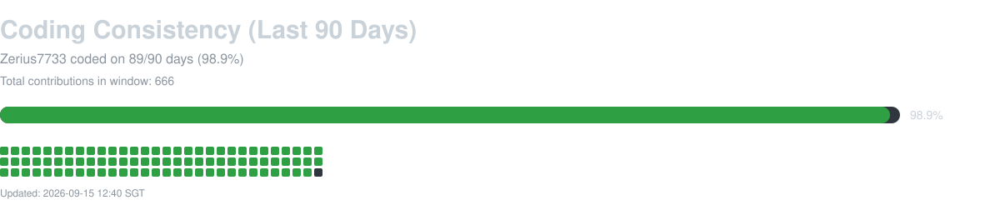
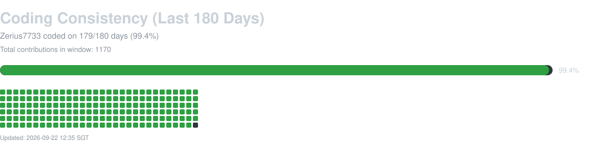
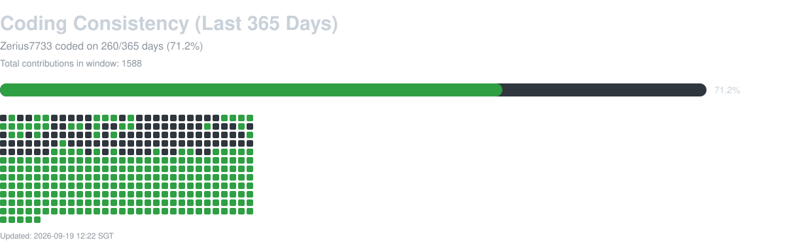
-->

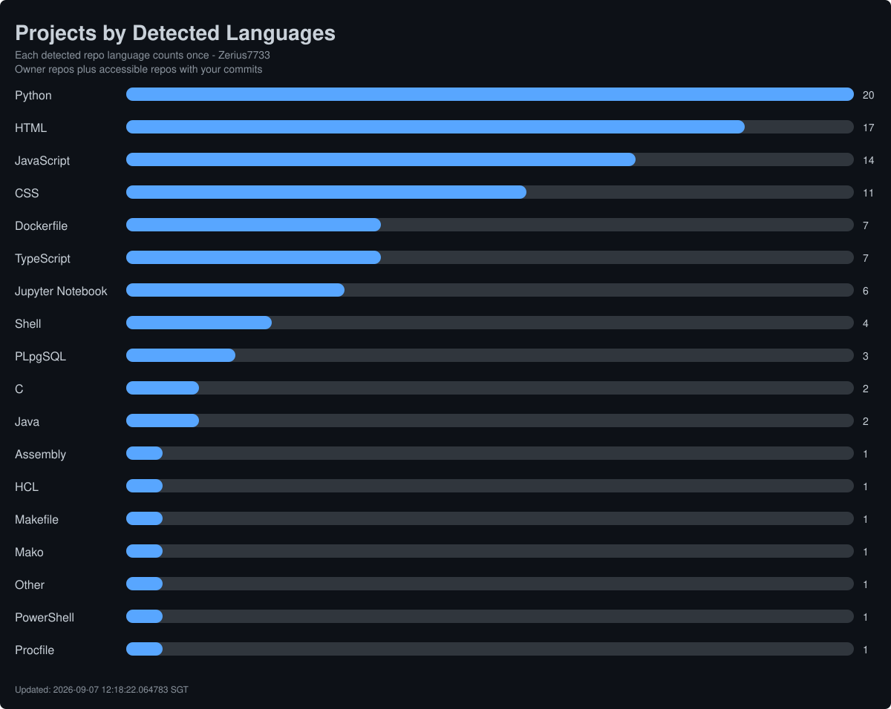

<strong>Commit Times</strong>

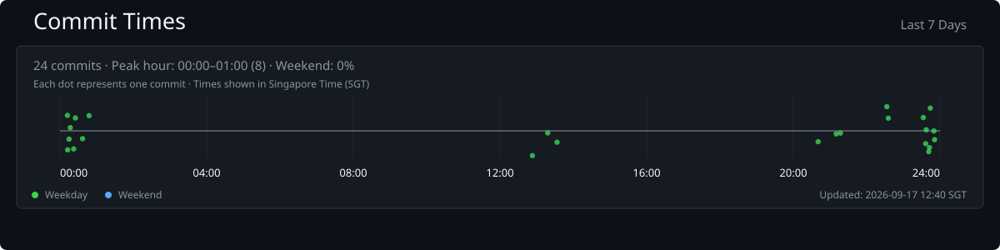
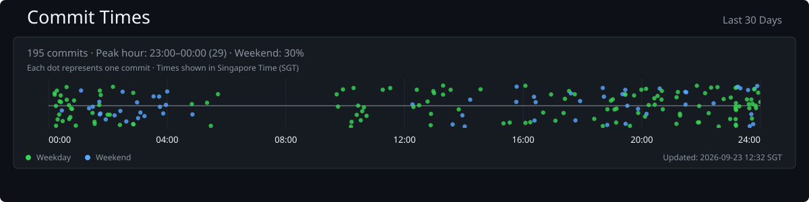
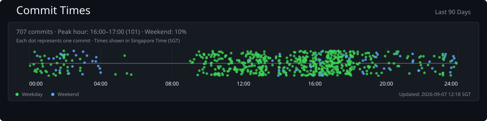
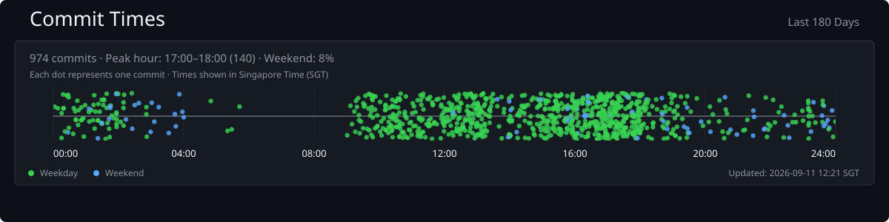

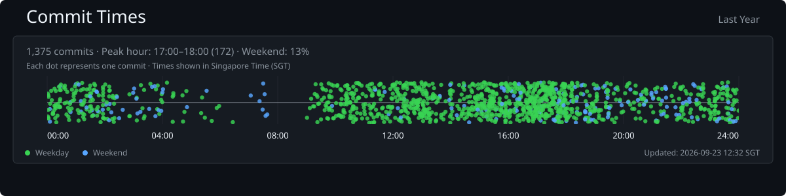

<strong>GitHub Stats</strong>

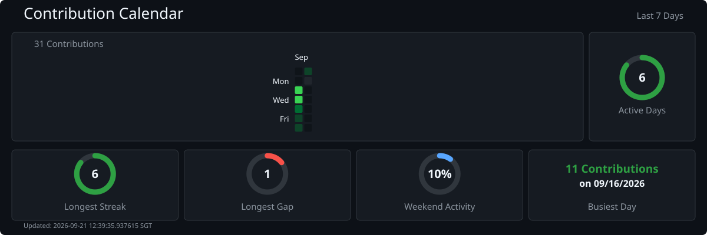
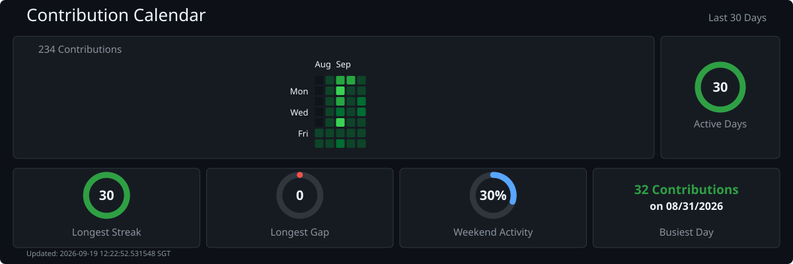
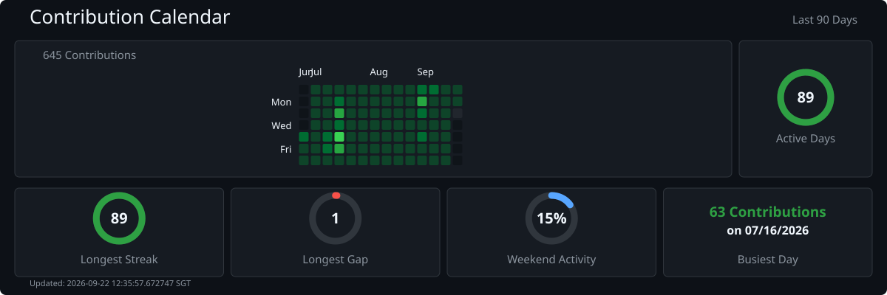
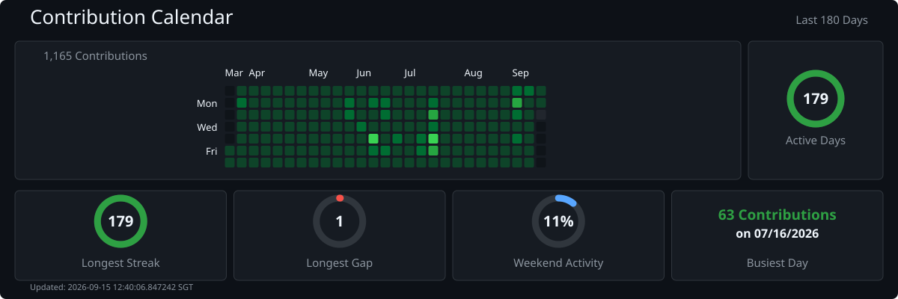

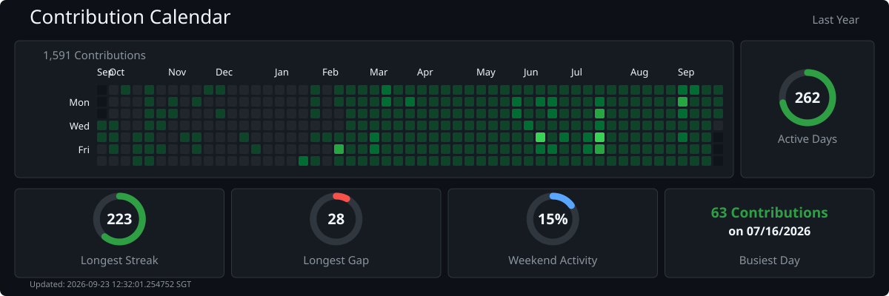

<strong>Lines of Code Analysis</strong>

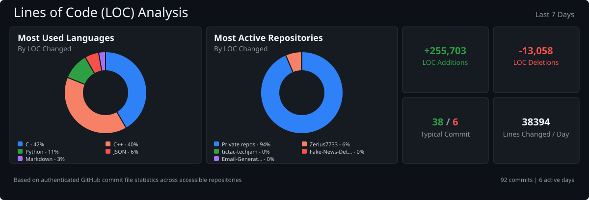
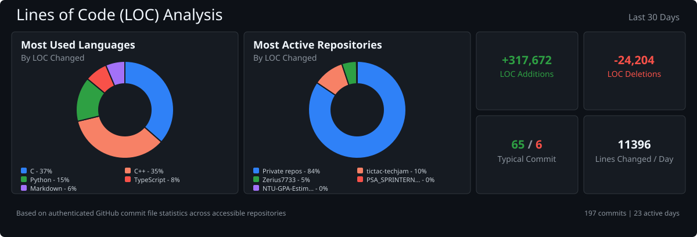
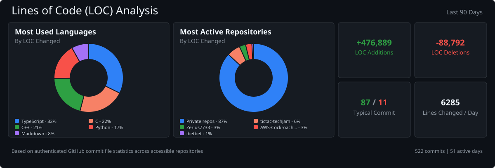
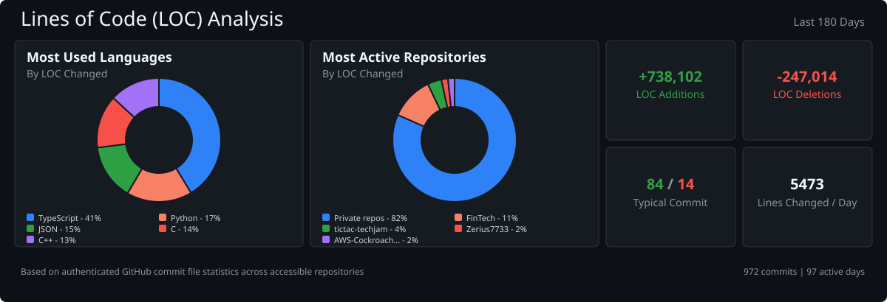

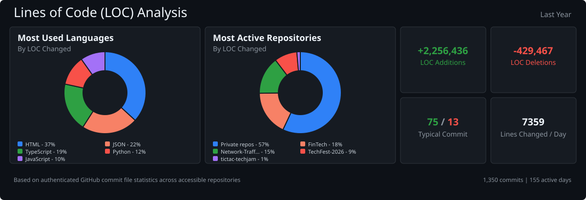

## Tech Toolbox

### Languages

### Frontend & Backend

-4285F4?style=for-the-badge&logo=googlechrome&logoColor=white)

### Databases & AI

### Infrastructure & Tooling

## Social Media

- [Instagram](https://instagram.com/Zerius7733)
- [LinkedIn](https://www.linkedin.com/in/guan-yibin/)

---

> Open to collaborations on AI, backend systems, and impactful student projects.

